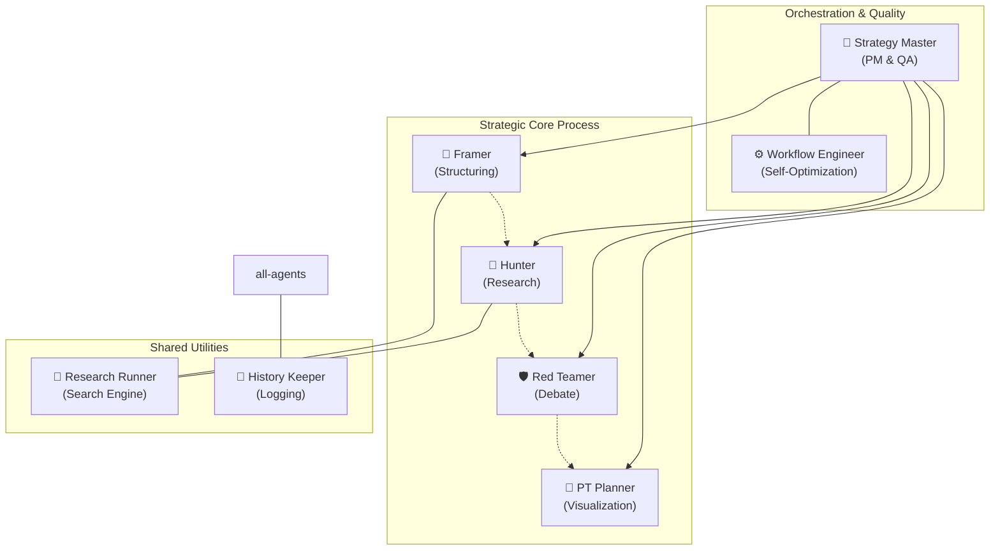
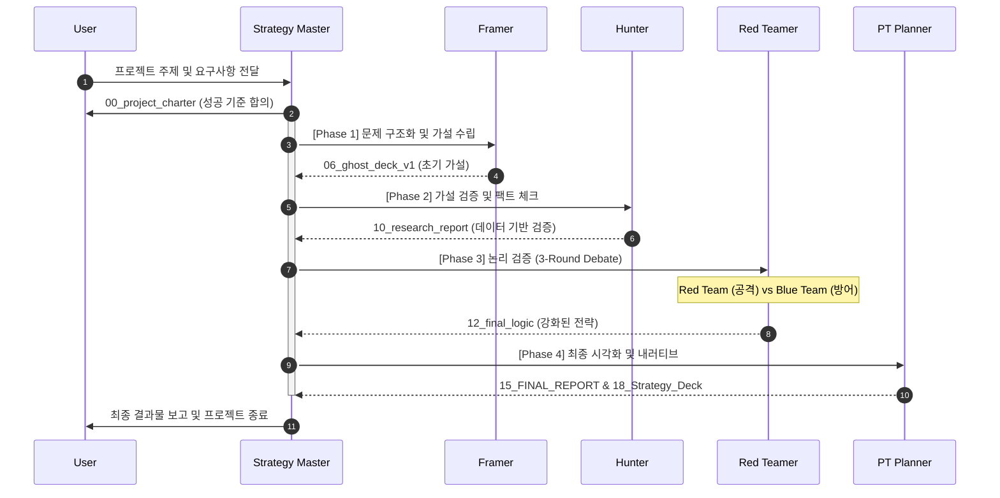

# 🚀 Autonomous Strategy Agent: The "Plan Writer"

> **MBB 수준의 전략 기획 보고서를 100% 자율적으로 생성하는 AI 에이전트 시스템**

이 프로젝트는 단순한 글쓰기 도구가 아닙니다.  
문제 정의부터 시장 조사, 가설 검증, 레드팀 방어, 그리고 최종 슬라이드 기획까지—  
**전략 컨설팅 펌(McKinsey, BCG, Bain)의 사고 프로세스(Project Cycle)**를 완벽하게 모사하는 7개의 AI 모듈로 구성된 **Team of Agents**입니다.

---

## 🏗️ System Architecture (The "7-Skill" Module)

이 시스템은 단일 LLM이 아닌, 각기 다른 전문성을 가진 **7개의 독립 스킬(Skill)**이 유기적으로 협업하는 **Multi-Agent** 구조입니다. Strategy Master가 전체 오케스트레이션을 담당하며, 하위 에이전트들이 각자의 역할을 수행합니다.

### Architecture Diagram



### Module Descriptions

| Module                   | Role                   | Description                                                                                              |
| :----------------------- | :--------------------- | :------------------------------------------------------------------------------------------------------- |
| **👑 Strategy Master**   | **PM & Orchestrator**  | 전체 프로젝트를 총괄하며, 각 단계의 산출물을 QA하고 **TDD 방식**으로 성공 기준(DoD)을 관리합니다.        |
| **🧠 Framer**            | **Structural Thinker** | 모호한 주제를 MECE하게 구조화하고, 데이터로 검증 가능한 **초기 가설(Ghost Deck)**을 설계합니다.          |
| **🔎 Hunter**            | **Deep Researcher**    | 시장 데이터를 수집하고, `Recursive Research Loop`를 통해 가설을 끝까지 검증(Fact Check)합니다.           |
| **🛡️ Red Teamer**        | **Debate Club**        | **"3-Round Recursive Debate"**를 통해 자신의 전략을 스스로 공격하고 방어하며 논리를 극한으로 연마합니다. |
| **🎨 PT Planner**        | **Storyteller**        | 최종 논리를 설득력 있는 **내러티브(Storyline)**와 **슬라이드 설계도**로 변환합니다.                      |
| **🏃 Research Runner**   | **Utility**            | 모든 스킬이 공통으로 사용하는 '검색 엔진'으로, **재무제표/통계** 등 Hard Data 수집에 특화되어 있습니다.  |
| **⚙️ Workflow Engineer** | **Meta-Optimizer**     | 프로젝트 종료 후 로그를 분석하여, 병목 구간을 찾고 **스스로 스킬을 업그레이드(Prompt Fix)**합니다.       |

---

## 🔄 Project Workflow (The Logic Factory)

Strategy Master는 'Raw Data'를 'Executive Presentation'으로 변환하기 위해 4단계의 선형적 프로세스를 따르되, 필요시 순환적(Recursive) 루프를 돕니다.

### Workflow Sequence



### Detailed Phase Breakdown

#### **[Phase 1] 구조화 (The Framer)**

> _"문제의 해체와 가설 수립"_

- **Research Design**: 3C, PESTEL 등 상황에 맞는 프레임워크 선정
- **Issue Tree**: MECE 원칙에 입각한 하위 과제 및 실행 질문 분해
- **Output**: Ghost Deck v1.0 (가설 기반 초안)

#### **[Phase 2] 검증 (The Hunter)**

> _"팩트 기반의 가설 검증"_

- **Fact Finding**: Perplexity 연동을 통한 실시간 데이터 및 통계 수집
- **Verification Loop**: 수집된 증거로 가설을 Confirm/Refute/Pivot 판정
- **Output**: Ghost Deck v2.0 (사실 기반 수정안)

#### **[Phase 3] 방어 및 연마 (The Red Teamer)**

> _"비판과 창의의 변증법"_

- **Recursive Debate**: 공격(Red) vs 방어(Blue)의 3라운드 치열한 논쟁
- **Defense Logic**: 비판에 대한 대응 논리 구축 및 전략 고도화
- **Output**: 최종 전략 보고서 (Final Strategy Report)

#### **[Phase 4] 시각화 기획 (PT Planner)**

> _"전달력 극대화"_

- **Narrative Design**: Hook-Problem-Analysis-Solution-Action 기반의 기승전결 (Storyline)
- **Slide Mapping**: 논리 흐름을 시각적으로 최적화하는 장표 설계
- **Output**: PPT 슬라이드 설계도 (Presentation Blueprint)

---

## 🔥 Key Features (Why Special?)

### 1. Recursive Fact-Check Loop (팩트 폭격)

단순히 그럴듯한 말을 지어내는 것이 아니라, **"빈 표(Table)를 채울 때까지"** 집요하게 검색합니다. 찾은 근거가 약하면(Nuanced), 스스로 판단하여 더 깊은 수준의 데이터를 재검색합니다.

### 2. Red vs Blue Debate (자가 검증)

선형적인 진행을 거부합니다. **Red Team(공격)**과 **Blue Team(방어)**으로 나뉘어 **최소 3라운드의 치열한 논쟁**을 벌입니다. 이 과정을 통해 논리적 구멍을 스스로 메우고, '설득되지 않는 전략'은 폐기합니다.

### 3. TDD for Strategy (테스트 주도 전략 수립)

프로젝트 시작 전 `00_project_charter.md`를 통해 **"성공의 기준(Definition of Done)"**을 먼저 정의합니다. 각 단계의 산출물은 이 기준을 통과하지 못하면 다음 단계로 넘어갈 수 없습니다.

### 4. Self-Healing Workflow (자기 진화)

`Workflow Engineer`는 프로젝트 수행 시간과 로그를 분석하여, **"어떤 스킬이 병목인지"** 찾아내고 프롬프트 개선안을 스스로 제안합니다. 쓸수록 똑똑해집니다.

---

## 📂 Directory Structure

모든 스킬은 `.agent/skills/` 하위에 **독립적인 패키지** 형태로 관리됩니다.

```text
.agent/
  skills/
    ├── strategy-master/       # PM & QA Checklists
    ├── strategy-framer/       # Problem Definition & Structuring
    ├── strategy-hunter/       # Deep Dive Research
    ├── strategy-redteamer/    # Recursive Debate Prompt
    ├── strategy-pt-planner/   # Slide & Narrative Design
    ├── util-research-runner/  # Search Utility
    ├── util-history-keeper/   # Project History & Logging
    └── util-workflow-engineer/# Performance Analysis & Self-Improvement
```

## 🚀 Getting Started

1.  **Initialize**: `strategy-master`를 호출하여 프로젝트를 정의합니다.
    > "이번 프로젝트는 ~에 대한 신사업 전략이야. 경쟁사 3곳의 매출 분석이 반드시 포함되어야 해."
2.  **Charter Generation**: 에이전트가 `00_project_charter.md`를 생성하여 성공 기준을 합의합니다.
3.  **Auto-Pilot**: 이후 Master가 각 스킬을 순차적으로 호출하며 보고서를 완성해 나갑니다.
4.  **Review**: `output/` 폴더에 생성된 최종 보고서(`15_FINAL_REPORT.md` 및 `18_Strategy_Deck.pptx`)를 확인합니다.

---

> _"Strategy is not about writing slides. It's about finding the undeniable truth."_
